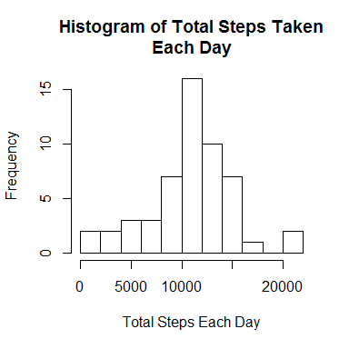
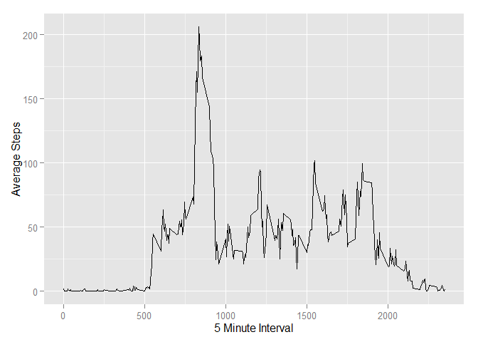
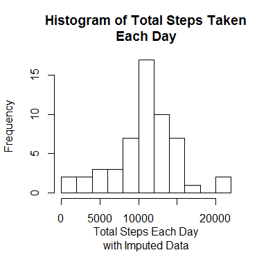
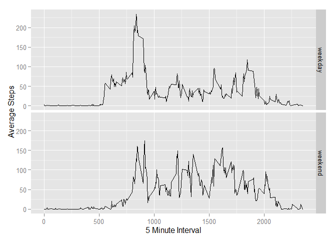

# Reproducible Research: Peer Assessment 1


## Loading and preprocessing the data


### 1.Load the data (i.e. read.csv())
- Using read.table and unz to read the data file directly

```r
activityCSV <- read.table(unz("activity.zip", "activity.csv"), header=T, sep=",")
```

### 2.Process/transform the data (if necessary) into a format suitable for your analysis
- Convert the date column into a POXITct date
- Set the group_by attribute to the new rdate column
- Clear out NA's

```r
activityCSVproc <- activityCSV %>% mutate(rdate=ymd(date)) %>% group_by(rdate)
completeCSV <- activityCSVproc[complete.cases(activityCSVproc),]
```


## What is mean total number of steps taken per day?

### 1.Calculate the total number of steps taken per day

```r
sumsteps <- summarize(completeCSV, totSteps=sum(steps))
head(sumsteps)
```

```
## Source: local data frame [6 x 2]
## 
##        rdate totSteps
## 1 2012-10-02      126
## 2 2012-10-03    11352
## 3 2012-10-04    12116
## 4 2012-10-05    13294
## 5 2012-10-06    15420
## 6 2012-10-07    11015
```

### 2.If you do not understand the difference between a histogram and a barplot, research the difference between them. Make a histogram of the total number of steps taken each day

```r
hist(sumsteps$totSteps, main="Histogram of Total Steps Taken\nEach Day", xlab="Total Steps Each Day", breaks=12)
```

 

### 3. Calculate and report the mean and median of the total number of steps taken per day

```r
summary(sumsteps$totSteps)
```

```
##    Min. 1st Qu.  Median    Mean 3rd Qu.    Max. 
##      41    8841   10760   10770   13290   21190
```


## What is the average daily activity pattern?
### 1.Make a time series plot (i.e. type = "l") of the 5-minute interval (x-axis) and the average number of steps taken, averaged across all days (y-axis)
- calculate the average for each 5-minute interval
- create the time series plot

```r
activityCSVinterval <- activityCSV %>% group_by(interval)
aciComplete <- activityCSVinterval[complete.cases(activityCSVinterval),]
aciComplete <- summarize(aciComplete, avgSteps=mean(steps))

ggplot(aciComplete, aes(aciComplete$interval, aciComplete$avgSteps)) + 
  xlab("5 Minute Interval") +
  ylab("Average Steps") +
  geom_line()
```

 

### 2.Which 5-minute interval, on average across all the days in the dataset, contains the maximum number of steps?

```r
maxInterval=aciComplete[aciComplete$avgSteps == max(aciComplete$avgSteps),]
print(maxInterval)
```

```
## Source: local data frame [1 x 2]
## 
##   interval avgSteps
## 1      835 206.1698
```


## Imputing missing values
### 1.Calculate and report the total number of missing values in the dataset (i.e. the total number of rows with NAs)

```r
count(activityCSV[is.na(activityCSV$steps),])
```

```
## Source: local data frame [1 x 1]
## 
##      n
## 1 2304
```
### 2.Devise a strategy for filling in all of the missing values in the dataset. The strategy does not need to be sophisticated. For example, you could use the mean/median for that day, or the mean for that 5-minute interval, etc.
- Let's use the mean for the corresponding time period as an imputed value for missing data

### 3.Create a new dataset that is equal to the original dataset but with the missing data filled in.

```r
activityCSVimpute <- activityCSV %>% mutate(stepsImpute=ifelse(!is.na(steps), steps, aciComplete[aciComplete$interval == interval,]$avgSteps))
head(activityCSVimpute)
```

```
##   steps       date interval stepsImpute
## 1    NA 2012-10-01        0   1.7169811
## 2    NA 2012-10-01        5   0.3396226
## 3    NA 2012-10-01       10   0.1320755
## 4    NA 2012-10-01       15   0.1509434
## 5    NA 2012-10-01       20   0.0754717
## 6    NA 2012-10-01       25   2.0943396
```

### 4.Make a histogram of the total number of steps taken each day and Calculate and report the mean and median total number of steps taken per day. Do these values differ from the estimates from the first part of the assignment? What is the impact of imputing missing data on the estimates of the total daily number of steps?
- Recreate the dataset used for the first analysis
- Produce the histogram
- Report mean and median total

```r
activityCSVprocImpute <- activityCSVimpute %>% 
  mutate(rdate=ymd(date)) %>% 
  group_by(rdate)
sumStepsImpute <- summarize(activityCSVprocImpute, totSteps=sum(stepsImpute))
hist(sumStepsImpute$totSteps, main="Histogram of Total Steps Taken\nEach Day", xlab="Total Steps Each Day\nwith Imputed Data", breaks=12)
```

 

```r
summary(sumStepsImpute$totSteps)
```

```
##    Min. 1st Qu.  Median    Mean 3rd Qu.    Max.    NA's 
##      41    8860   10770   10770   13190   21190       7
```

## Are there differences in activity patterns between weekdays and weekends?
### 1.Create a new factor variable in the dataset with two levels - "weekday" and "weekend" indicating whether a given date is a weekday or weekend day.

```r
activityCSVprocImpute <- mutate(activityCSVprocImpute, dayType=ifelse((wday(rdate)==1 | wday(rdate)==7), "weekend","weekday"))
activityCSVprocImpute$dayType <- as.factor(activityCSVprocImpute$dayType)
head(activityCSVprocImpute)
```

```
## Source: local data frame [6 x 6]
## Groups: rdate
## 
##   steps       date interval stepsImpute      rdate dayType
## 1    NA 2012-10-01        0   1.7169811 2012-10-01 weekday
## 2    NA 2012-10-01        5   0.3396226 2012-10-01 weekday
## 3    NA 2012-10-01       10   0.1320755 2012-10-01 weekday
## 4    NA 2012-10-01       15   0.1509434 2012-10-01 weekday
## 5    NA 2012-10-01       20   0.0754717 2012-10-01 weekday
## 6    NA 2012-10-01       25   2.0943396 2012-10-01 weekday
```
### 2.Make a panel plot containing a time series plot (i.e. type = "l") of the 5-minute interval (x-axis) and the average number of steps taken, averaged across all weekday days or weekend days (y-axis). See the README file in the GitHub repository to see an example of what this plot should look like using simulated data.

```r
activityCSVinterval2 <- activityCSVprocImpute %>% group_by(interval, dayType)
aciComplete2 <- activityCSVinterval2[complete.cases(activityCSVinterval2),]
aciComplete2 <- summarize(aciComplete2, avgSteps=mean(steps))

tsPlot <- ggplot(aciComplete2, aes(interval, avgSteps)) + 
  facet_grid(dayType ~ .) +
  xlab("5 Minute Interval") +
  ylab("Average Steps") +
  geom_line()
print(tsPlot)
```

 


